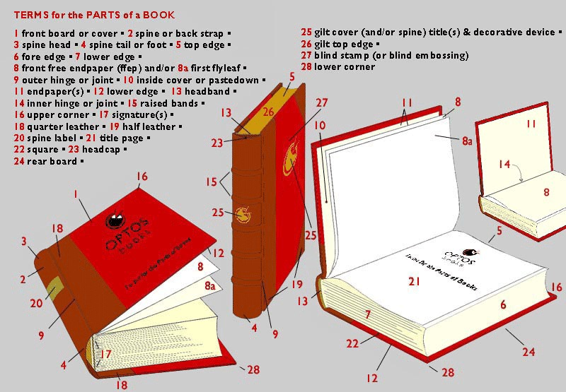

# Book Dissection

Terminology and Description are the fundamentals of book history. This class will be a hands-on introductory experience - we will take apart a book (physically and analytically) to understand the "technology" of the modern codex format. Your goal will be to both identify the constituent elements of the book (the different parts of the physical book) and then describe the content. Our goal is ultimately an archaeology of the book, taking it apart and in essence destroying it, to learn from this process of physical deconstruction. We also want to learn from the book itself, cataloguing the contents and other evidence of ownership/ provenance.&#x20;

### Advance Preparation:&#x20;

Watch this video by bookbinder Glenn Malkin, about how to "pull" a book: [https://youtu.be/dbIlMkjxFxM](https://youtu.be/dbIlMkjxFxM)

Consult terminology in the Rare Book and Manuscript Section _Thesaurus_ for cataloguing here: [RBMS Controlled Vocabularies](https://rbms.info/vocabularies/index.shtml)

### Stages:

1. Choose a physical book from the samples provided to you by the professor
2. Take it apart, documenting the different stages of your "dissection". This should consist of notes which describe the process you take as well as a series of pictures you captured on your phone, or a video. As you take it apart, make sure to keep a list of everything you've done and all the parts (which you should be able to label) you have removed.&#x20;
3. Breakdown the book into what you see as its contituent parts. Identify and label them (physically or on digital images) using proper codicodological/ descriptive bibliography terminology: try to identify as many parts as possible as laid out in the following diagrams:

&#x20;  4\. Ideally identify as much information as possible in the following descriptive template:


Identify the features outlined in this template.


